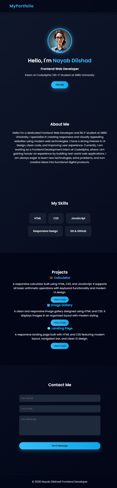

# 💼 Personal Portfolio Website

This is my personal portfolio website built using HTML, CSS, and JavaScript. It showcases my skills, projects, and contact information in a modern and responsive design.

## 🚀 Features
- Responsive design (mobile, tablet, desktop)
- Smooth scrolling navigation
- Attractive UI with gradient styling
- Profile section with introduction
- Skills section with highlights
- Projects section with GitHub links
- Contact form with interaction
- Clean and structured layout

## 🛠️ Technologies Used
- HTML5
- CSS3 (Flexbox, Responsive Design)
- JavaScript

## 📂 Sections Included
- Home
- About Me
- Skills
- Projects
- Contact

## 📸 Preview

## 🔗 Live Projects
- 🧮 Calculator  
  https://github.com/nayabD123/Code-Alpha-Calculator  

- 🖼 Image Gallery  
  https://github.com/nayabD123/Code-Alpha-Image-Gallery  

- 🌐 Landing Page  
  https://github.com/nayabD123/landing-page

## ▶️ How to Run
1. Download or clone the repository  
2. Open the project folder  
3. Open `index.html` in any browser  

## 🎯 Purpose of Project
This project is created to showcase my front-end development skills, including UI design, responsiveness, and JavaScript functionality.

---

✨ Developed by Nayab Dilshad  
Frontend Web Developer | BS IT Student | CodeAlpha Intern
